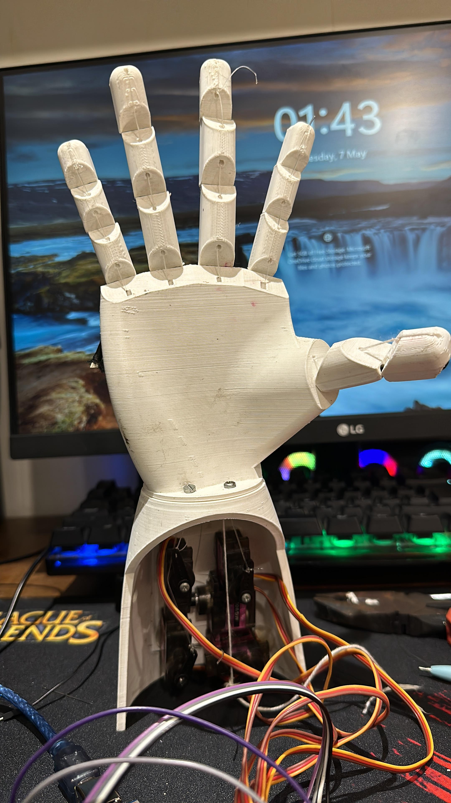
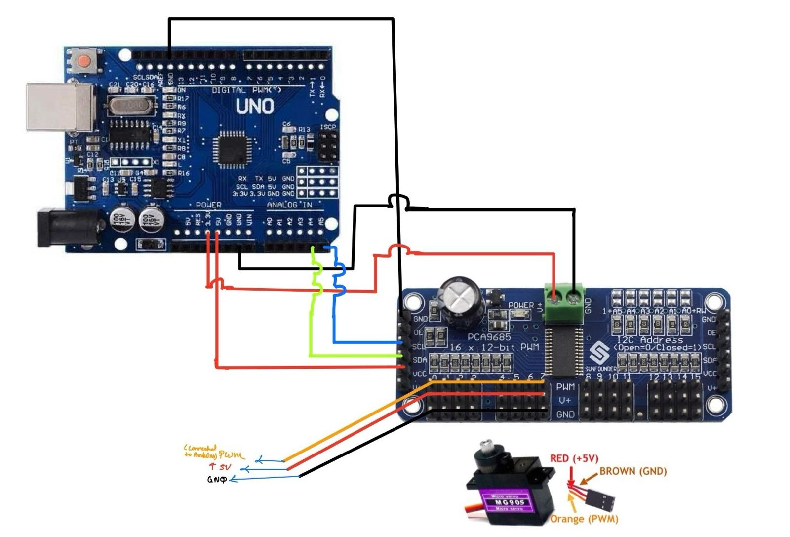

# Prosthetic Hand Using Arduino and PCA9685 Servo Motor Driver.

Have you ever imagined creating a robotic hand? Cool, right?  
Before you start building this amazing project, check out this **[viral video reel](https://www.instagram.com/reel/C81rujxsz5r/?utm_source=ig_web_copy_link&igsh=MzRlODBiNWFlZA==)** showcasing a functional prosthetic hand that inspired this project.  

This guide will walk you through creating a prosthetic hand using **Arduino**, **PCA9685 Servo Motor Driver**, nylon threads, elastic threads, and 3D-printed parts. It's an exciting project combining **mechanical design**, **electronics**, and **programming**!

---

## Components Required
To create this project, you will need the following components:

### Mechanical Components:
1. 3D-printed parts (fingers, palm, and frame)  
2. Black 1 mm elastic thread (for finger support)  
3. Nylon threads (for finger movements)

### Electronics:
1. **Arduino Uno** (microcontroller)  
2. **PCA9685 Servo Motor Driver**  
3. Servo motors (MG90S or equivalent)  
4. Jumper wires (Male-to-Male and Male-to-Female)  
5. Breadboard (optional)  
6. Power supply (5V for the servo motor driver)  

### Software:
1. **Arduino IDE**  
2. Libraries:
   - `Wire.h` for serial communication  
   - `PWMServoMotorDriver.h` for PCA9685 Servo Motor Driver  

---

## Steps to Create the Prosthetic Hand

### Step 1: Print the 3D Parts
Print the 3D parts using `.stl` files. Refer to [this video tutorial](https://youtu.be/Fvg-v8FPcjg?si=KikUXmBYxO24s8cP) for detailed guidance on printing the 3D parts.

---

### Step 2: Attach Servo Motors
Attach the servo motors to the prosthetic hand structure as shown in the image.

---

### Step 3: Assemble Nylon Threads and Elastic Thread
- Use nylon threads to attach the 3D-printed fingers.  
- Tie black 1 mm elastic threads along the fingers for additional support.

---

### Step 4: Tie Nylon Threads to Servo Motors
- Secure the nylon threads to the respective servo motors to control finger movement.

---

## Electronics Part

### Step 5: Connect the Servo Motors
- Connect the servo motors to the PCA9685 as follows:  
  - **Black wire**: Ground (GND)  
  - **Red wire**: +5V (power)  
  - **Signal wire (Orange)**: Connect to the **Yellow pin** of the servo motor driver  

---

### Step 6: Connect the SCL Pin
- Connect the **SCL pin** of the PCA9685 to **A5** on the Arduino Uno.

---

### Step 7: Connect the SDA Pin
- Connect the **SDA pin** of the PCA9685 to **A4** on the Arduino Uno.

---

### Step 8: Power Connections
- Connect the **VCC** and **GND** pins of the PCA9685 to:  
  - **5V** of the Arduino Uno  
  - **GND** of the Arduino Uno  

---

Kindly refer to the following photo for connections.

## Programming the Prosthetic Hand

1. **Upload the Code**:  
   - Before proceeding with the connections, upload the provided code to the Arduino Uno.  
   - Make sure to download the necessary libraries:
     - `Wire.h`
     - `PWMServoMotorDriver.h`
   - Set the baud rate to **9600 MHz** in the Arduino IDE.
   - Keep your PC connected to the Arduino Uno.

2. **Commands for Movements**:  
   Open the Serial Monitor in the Arduino IDE and enter the following commands to control the hand:

3. **Keep the angle of servo motor between 0 ~ 150 in PCA9685 Servo Driver to 180 ~ 600 degrees**.
  - The Max angle is 600 & MIN angle is 150 in PCA9685 Motor Driver.

| Command | Action             |
|---------|--------------------|
| `1`     | Open the hand      |
| `2`     | Close the hand     |
| `3`     | Count 1            |
| `4`     | Count 2            |
| `5`     | Count 3            |
| `6`     | Count 4            |
| `7`     | Count 5            |
| `8`     | Victory gesture    |
| `9`     | Yo gesture         |

---

## Disclaimer
Ensure proper connections and follow instructions carefully. This project should be attempted under professional supervision. **Do at your own risk.**

---

## Author
- **Ketan Thorat**
  - Founder of [Robonex Innovations](https://robonex.in)
  - Follow on Instagram: [@ketanthorat.ai](https://instagram.com/ketanthorat.ai)
  - For any queries, kindly mail at ketanthorat.ai@gmail.com
---

### License
All entities and content are trademarks of Robonex Innovations. For more projects, visit our website or social media.

Happy Learning!  
Signing off,  
Ketan Thorat

